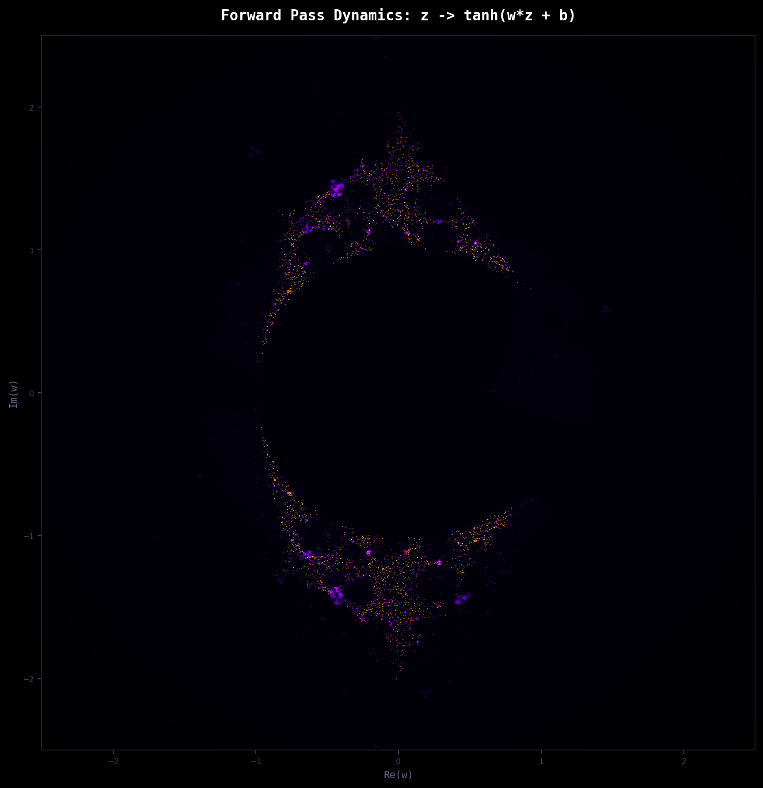
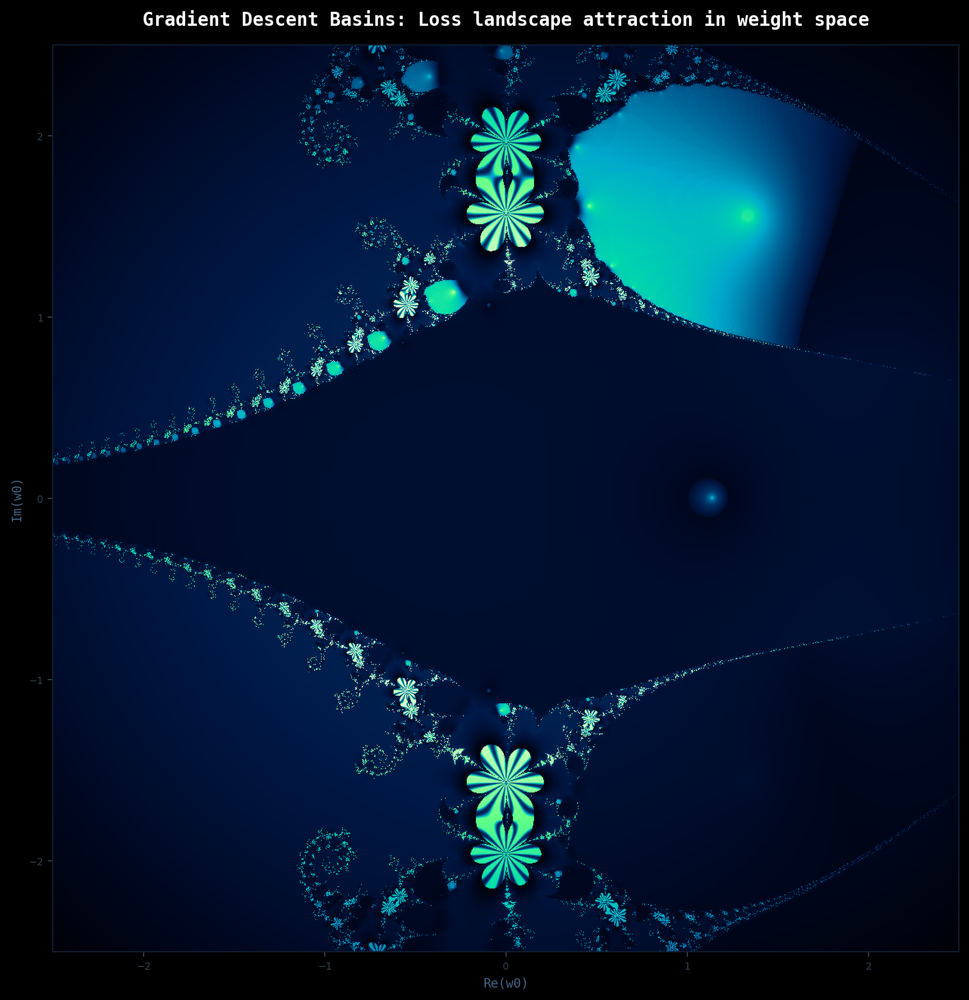

# 🌀 deepfractals

Deep learning math iterated across the complex plane. The fractal geometry that emerges reflects how networks actually behave; where they converge, where they explode, and what sits at the edge between the two.

---

## Fractals

### 1. Forward Pass Dynamics
**`forward_pass.py`**

Iterates a single neural layer `z -> tanh(w*z + b)` as a complex map, where `w` is the weight, `z` is the input, and `b` is the bias.
`w` and `b` are both derived from the same complex coordinate `c`, where `w = c` and `b = c * 0.3j`.
`tanh` normally squashes real values into `(-1, 1)`, but in the complex plane that bound disappears, which is what makes escape and fractal structure possible in the first place.
Color encodes whether the repeated forward pass diverges or stabilizes, and how fast.

  

### 2. Loss Landscape Basins of Attraction
**`gradient_basin.py`**

Iterates the gradient update rule `w -> w - lr * dL/dw` as a complex map, where `lr` is the learning rate and `dL/dw` is the gradient of the loss evaluated at `w`.
The loss is defined over a small synthetic dataset as `L(w) = sum( tanh(w * x) - y )^2`.
For each starting weight `w0` in the complex plane, gradient descent runs until it converges to a local minimum. In the real line this is straightforward optimization, but in the complex plane the basins of attraction shatter into fractal boundaries, the same geometry that makes weight initialization so sensitive in practice.

  

### 3. Backpropagation Error Flow
**`backpropagation_error_flow.py`**

Iterates the backward pass `delta -> tanh'(w * delta) * delta + c` as a complex map, where `delta` is the error signal flowing backward and `tanh'(z) = 1 - tanh^2(z)` is the local gradient that scales it at each layer.
For each point in the complex plane, `w` encodes the weight and `c` encodes the input. Color encodes whether the error signal escapes to infinity, vanishes to zero, or orbits near the unit circle, the same three regimes that determine whether a deep network trains, dies, or explodes.

  

## Reading the geometry
Each fractal is a geometric consequence of the same math that governs how neural networks learn. The forward pass, the gradient descent basins, the backpropagation error flow; iterated in the complex plane, they produce structure that maps directly to training behavior. Where the geometry is smooth, training is stable. Where it shatters, it is sensitive. The boundary between the two is where the interesting math lives.
